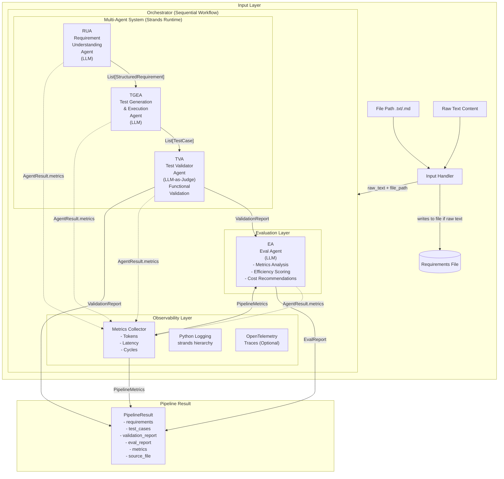
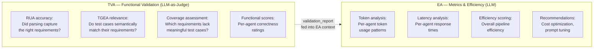

# Design Document: AI Software Testing Assistant

## Overview

The AI Software Testing Assistant is a multi-agent pipeline built on the Strands Agents SDK. Four specialized agents — Requirement Understanding Agent (RUA), Test Generation & Execution Agent (TGEA), Test Validator Agent (TVA), and Eval Agent (EA) — are orchestrated sequentially using the Workflow pattern. All four are LLM-powered Strands agents. The TVA acts as an LLM-as-judge for functional correctness of the other agents' outputs. The EA focuses on metrics analysis and efficiency evaluation. Each agent is a separate Python module exposing a single entry-point function with typed dataclass inputs and outputs.

The system uses Python dataclasses for all inter-agent data schemas. Each agent wraps a Strands `Agent` instance with a role-specific system prompt and leverages Pydantic-based structured output (`structured_output_model`) for type-safe, validated responses — eliminating the need for manual JSON parsing.

### Best Practices Applied (from Strands Docs)

- **Focused system prompts**: Each agent gets a single-responsibility system prompt so the LLM stays on task
- **Structured output**: Agents use `structured_output_model` with Pydantic models for validated, typed responses instead of raw text parsing
- **`@tool` decorator**: Tools use clear docstrings and type hints so the LLM understands when and how to use them
- **Workflow pattern**: The orchestrator follows the deterministic Workflow pattern — a pre-defined sequential pipeline with no cycles, matching the AWS Prescriptive Guidance "Workflow for Orchestration" approach
- **`callback_handler=None`**: Agents suppress console output for programmatic pipeline use
- **Modular agents**: Each agent can be extended, swapped, or used independently thanks to the modular interface pattern

## Architecture

### System Overview



### Agent Responsibility Split



The orchestrator is a thin sequential runner (Workflow pattern). It:
1. Resolves the input — if a file path, reads it; if raw text, writes it to a file and uses that path.
2. Passes raw text to the RUA (LLM), receives `List[StructuredRequirement]` via structured output.
3. Passes that list to the TGEA (LLM), receives `List[TestCase]` via structured output.
4. Passes the raw text, requirements, and test cases to the TVA (LLM-as-judge), receives `ValidationReport` with functional correctness scores and semantic coverage assessment.
5. Passes the collected pipeline metrics to the EA (LLM), receives `EvalReport` with efficiency analysis and cost recommendations.
6. Returns a `PipelineResult` containing all four outputs, the source file path, and metrics.

All four agents are constructed with `Agent(system_prompt=..., model=model, callback_handler=None)` and invoked with `structured_output_model`.

## Model Provider Configuration

The system supports two model providers, selected via an environment variable (`MODEL_PROVIDER`):

- **LiteLLM + Groq** — for local development and testing (fast, low-cost)
- **BedrockModel** — for AWS deployment (production-grade, Claude Sonnet on Bedrock)

```python
import os
from strands.models import BedrockModel

def get_model():
    """Return the configured model provider based on environment."""
    provider = os.environ.get("MODEL_PROVIDER", "bedrock")
    
    if provider == "groq":
        from strands.models.litellm import LiteLLMModel
        return LiteLLMModel(
            client_args={"api_key": os.environ["GROQ_API_KEY"]},
            model_id="groq/llama-3.3-70b-versatile",
            params={"max_tokens": 4096, "temperature": 0.3},
        )
    else:
        return BedrockModel(
            model_id="us.anthropic.claude-sonnet-4-20250514-v1:0",
            temperature=0.3,
        )
```

Each agent uses `get_model()` at construction time:

```python
from strands import Agent

agent = Agent(
    system_prompt="...",
    model=get_model(),
    callback_handler=None,
)
```

### Environment Setup

**Local development (Groq via LiteLLM):**
```bash
pip install 'strands-agents[litellm]'
export MODEL_PROVIDER=groq
export GROQ_API_KEY=your-groq-api-key
```

**AWS deployment (Bedrock):**
```bash
pip install strands-agents
export MODEL_PROVIDER=bedrock
# AWS credentials via aws configure, env vars, or IAM role
```

### Deployment Considerations

For production on AWS, the system is designed to be compatible with Bedrock AgentCore Runtime. The modular agent architecture (each agent as a separate module with typed I/O) and the built-in OpenTelemetry tracing align with AgentCore's managed infrastructure. AgentCore deployment is not in scope for the MVP but is a natural extension point.

## Input Handling

The system accepts requirements in two forms:

1. **File path**: A path to a `.txt` or `.md` file. The system reads the file and uses its contents.
2. **Raw text**: A string of requirement text. The system writes it to a timestamped file in the output directory (default: `./output/`) for reference, then proceeds.

```python
import os
from pathlib import Path
from datetime import datetime

def resolve_input(input_value: str, output_dir: str = "./output") -> tuple[str, str]:
    """Resolve input to (raw_text, file_path).
    
    If input_value is an existing file path, read it.
    If it's raw text, write it to a file and return both.
    """
    path = Path(input_value)
    if path.is_file():
        raw_text = path.read_text(encoding="utf-8")
        return raw_text, str(path)
    
    # It's raw text — write to file
    os.makedirs(output_dir, exist_ok=True)
    timestamp = datetime.now().strftime("%Y%m%d_%H%M%S")
    file_path = Path(output_dir) / f"requirements_{timestamp}.txt"
    file_path.write_text(input_value, encoding="utf-8")
    return input_value, str(file_path)
```

The `PipelineResult` includes the resolved `source_file` path so downstream consumers know where the requirements are persisted.

## Components and Interfaces

### Module Structure

```
ai_testing_assistant/
├── __init__.py
├── models.py              # Dataclass + Pydantic model definitions
├── model_provider.py      # LiteLLM/Groq + BedrockModel provider config
├── input_handler.py       # File path / raw text resolution
├── observability.py       # Metrics extraction, logging config, optional OTel setup
├── agents/
│   ├── __init__.py
│   ├── requirement_agent.py   # RUA entry point
│   ├── test_gen_agent.py      # TGEA entry point
│   ├── validator_agent.py     # TVA entry point
│   └── eval_agent.py          # EA entry point
└── orchestrator.py        # Sequential pipeline runner (Workflow pattern)
```

### Entry Points

| Module | Function | Input | Output |
|--------|----------|-------|--------|
| `requirement_agent` | `parse_requirements(raw_text: str) -> List[StructuredRequirement]` | Raw requirement text | List of structured requirements |
| `test_gen_agent` | `generate_and_execute(requirements: List[StructuredRequirement]) -> List[TestCase]` | Structured requirements | List of test cases with results |
| `validator_agent` | `validate(raw_text: str, requirements: List[StructuredRequirement], test_cases: List[TestCase]) -> ValidationReport` | Raw text + requirements + test cases | Functional validation report |
| `eval_agent` | `evaluate(pipeline_metrics: PipelineMetrics) -> EvalReport` | Pipeline metrics | Eval report with efficiency analysis |
| `orchestrator` | `run_pipeline(input_value: str) -> PipelineResult` | File path or raw text | Full pipeline result |

### Agent Construction Pattern

Each agent follows the Strands SDK pattern with structured output for type-safe responses:

```python
from strands import Agent
from pydantic import BaseModel, Field
from typing import List

class RequirementList(BaseModel):
    """List of structured requirements parsed from raw text."""
    requirements: List[StructuredRequirement]

agent = Agent(
    system_prompt="You are the Requirement Understanding Agent. Parse raw requirement text into structured requirements with id, description, priority, and category.",
    callback_handler=None  # suppress console output for programmatic use
)

result = agent(
    f"Parse these requirements:\n{raw_text}",
    structured_output_model=RequirementList
)
requirements = result.structured_output.requirements
```

This approach uses Pydantic validation to ensure the LLM response matches the expected schema, with automatic retries on validation failure (per Strands docs).

## Data Models

All data models are Python dataclasses with JSON serialization support. Pydantic wrapper models are used for structured output from agents.

### Core Dataclasses

```python
from dataclasses import dataclass, field, asdict
from typing import List, Optional
import json

@dataclass
class StructuredRequirement:
    id: str                    # e.g. "REQ-001"
    description: str           # Requirement description
    priority: str              # "high", "medium", "low"
    category: str              # e.g. "functional", "non-functional"

@dataclass
class TestCase:
    id: str                    # e.g. "TC-001"
    description: str           # Test case description
    input_data: str            # Input for the test
    expected_output: str       # Expected result
    requirement_id: str        # Linked requirement ID
    result: Optional[str] = None  # "pass" or "fail" after execution

@dataclass
class ValidationReport:
    rua_score: float           # 0.0 to 1.0 — RUA parsing accuracy
    tgea_score: float          # 0.0 to 1.0 — TGEA test case relevance
    coverage_assessment: str   # Semantic coverage summary
    uncovered_requirements: List[str] = field(default_factory=list)
    issues: List[str] = field(default_factory=list)

@dataclass
class PipelineResult:
    requirements: List[StructuredRequirement] = field(default_factory=list)
    test_cases: List[TestCase] = field(default_factory=list)
    validation_report: Optional[ValidationReport] = None
    eval_report: Optional['EvalReport'] = None
    source_file: str = ""              # Path to the requirements file

@dataclass
class MetricsSummary:
    total_tokens: int = 0
    total_latency_ms: float = 0.0
    per_agent_summary: List[str] = field(default_factory=list)
    efficiency_observations: str = ""

@dataclass
class EvalReport:
    metrics_summary: Optional[MetricsSummary] = None
    efficiency_score: float = 0.0      # 0.0 to 1.0
    recommendations: List[str] = field(default_factory=list)
```

### Pydantic Wrapper Models (for Structured Output)

```python
from pydantic import BaseModel, Field
from typing import List, Optional

class RequirementModel(BaseModel):
    id: str = Field(description="Requirement identifier, e.g. REQ-001")
    description: str = Field(description="Requirement description")
    priority: str = Field(description="Priority: high, medium, or low")
    category: str = Field(description="Category: functional or non-functional")

class RequirementListModel(BaseModel):
    requirements: List[RequirementModel]

class TestCaseModel(BaseModel):
    id: str = Field(description="Test case identifier, e.g. TC-001")
    description: str = Field(description="Test case description")
    input_data: str = Field(description="Input for the test")
    expected_output: str = Field(description="Expected result")
    requirement_id: str = Field(description="Linked requirement ID")
    result: Optional[str] = Field(default=None, description="pass or fail")

class TestCaseListModel(BaseModel):
    test_cases: List[TestCaseModel]

class ValidationReportModel(BaseModel):
    rua_score: float = Field(description="RUA parsing accuracy score 0.0 to 1.0")
    tgea_score: float = Field(description="TGEA test case relevance score 0.0 to 1.0")
    coverage_assessment: str = Field(default="", description="Semantic coverage summary")
    uncovered_requirements: List[str] = Field(default_factory=list)
    issues: List[str] = Field(default_factory=list, description="Identified issues with agent outputs")

class MetricsSummaryModel(BaseModel):
    total_tokens: int = Field(default=0, description="Total tokens used across all agents")
    total_latency_ms: float = Field(default=0.0, description="Total latency in milliseconds")
    per_agent_summary: List[str] = Field(default_factory=list, description="Summary per agent")
    efficiency_observations: str = Field(default="", description="Observations about pipeline efficiency")

class EvalReportModel(BaseModel):
    metrics_summary: Optional[MetricsSummaryModel] = Field(default=None)
    efficiency_score: float = Field(default=0.0, description="Overall pipeline efficiency 0.0 to 1.0")
    recommendations: List[str] = Field(default_factory=list, description="Actionable recommendations for cost and performance")
```

### Serialization

Serialization uses `dataclasses.asdict()` + `json.dumps()` for encoding and keyword-unpacking for decoding:

```python
# Serialize
json_str = json.dumps(asdict(requirement))

# Deserialize
data = json.loads(json_str)
requirement = StructuredRequirement(**data)
```


## Correctness Properties

*A property is a characteristic or behavior that should hold true across all valid executions of a system-essentially, a formal statement about what the system should do. Properties serve as the bridge between human-readable specifications and machine-verifiable correctness guarantees.*

### Property 1: Structured requirement round-trip serialization

*For any* valid `StructuredRequirement` object, serializing it to JSON via `dataclasses.asdict()` + `json.dumps()` and then deserializing via `json.loads()` + `StructuredRequirement(**data)` should produce an object equivalent to the original.

**Validates: Requirements 1.3, 5.3**

### Property 2: Test case round-trip serialization

*For any* valid `TestCase` object, serializing it to JSON via `dataclasses.asdict()` + `json.dumps()` and then deserializing via `json.loads()` + `TestCase(**data)` should produce an object equivalent to the original.

**Validates: Requirements 5.4**

### Property 3: Whitespace-only input yields empty requirements

*For any* string composed entirely of whitespace characters (spaces, tabs, newlines), the `parse_requirements` function should return an empty list.

**Validates: Requirements 1.2**

### Property 4: Test generation covers all requirements

*For any* non-empty list of `StructuredRequirement` objects, the `generate_and_execute` function should return a list of `TestCase` objects where every requirement ID from the input appears as the `requirement_id` of at least one test case, and every test case has a `result` field that is either "pass" or "fail".

**Validates: Requirements 2.1, 2.2**

### Property 5: Orchestrator error identification

*For any* agent failure in the pipeline (RUA, TGEA, or TVA), the orchestrator should propagate an error whose message identifies which agent failed.

**Validates: Requirements 4.3**

## Observability

The system leverages the Strands SDK's built-in observability capabilities to capture metrics, traces, and logs for each agent invocation. This enables performance monitoring, debugging, and evaluation of the pipeline.

### Metrics Collection

Each agent invocation returns an `AgentResult` with a `metrics` attribute (`EventLoopMetrics`) that tracks:

- **Token usage**: Input tokens, output tokens, total tokens, and cache metrics per agent
- **Latency**: Execution time per agent invocation and per event loop cycle
- **Tool usage**: Call counts, success rates, and execution times for any tools used
- **Cycle counts**: Number of reasoning cycles each agent required

The orchestrator collects metrics from each agent's `AgentResult` and aggregates them into a `PipelineMetrics` dataclass:

```python
@dataclass
class AgentMetrics:
    agent_name: str
    input_tokens: int
    output_tokens: int
    total_tokens: int
    latency_ms: float
    cycle_count: int

@dataclass
class PipelineMetrics:
    agent_metrics: List[AgentMetrics] = field(default_factory=list)
    total_tokens: int = 0
    total_latency_ms: float = 0.0
```

Metrics are extracted from each `AgentResult` like this:

```python
result = agent(prompt, structured_output_model=SomeModel)

agent_metrics = AgentMetrics(
    agent_name="RequirementUnderstandingAgent",
    input_tokens=result.metrics.accumulated_usage.get("inputTokens", 0),
    output_tokens=result.metrics.accumulated_usage.get("outputTokens", 0),
    total_tokens=result.metrics.accumulated_usage.get("totalTokens", 0),
    latency_ms=result.metrics.accumulated_metrics.get("latencyMs", 0),
    cycle_count=len(result.metrics.agent_invocations[-1].cycles) if result.metrics.agent_invocations else 0,
)
```

### Logging

The system configures Python's standard `logging` module for the `strands` logger hierarchy:

```python
import logging

logging.getLogger("strands").setLevel(logging.INFO)
logging.basicConfig(
    format="%(levelname)s | %(name)s | %(message)s",
    handlers=[logging.StreamHandler()]
)
```

- **DEBUG level**: Enabled during development for detailed tool registration, execution, and event loop tracing
- **INFO level**: Default for production — general operational messages
- **WARNING/ERROR**: Validation failures, model errors, and agent exceptions

### OpenTelemetry Tracing (Optional)

For production deployments, the system supports OpenTelemetry-based distributed tracing via the Strands `StrandsTelemetry` helper:

```python
from strands.telemetry import StrandsTelemetry

telemetry = StrandsTelemetry()
telemetry.setup_otlp_exporter()  # Send traces to OTLP endpoint (Jaeger, X-Ray, etc.)
```

This captures hierarchical spans for each agent invocation, model call, and tool execution — compatible with Jaeger, AWS X-Ray, Grafana Tempo, and other OpenTelemetry backends.

### Updated PipelineResult

The `PipelineResult` dataclass is extended to include metrics:

```python
@dataclass
class PipelineResult:
    requirements: List[StructuredRequirement] = field(default_factory=list)
    test_cases: List[TestCase] = field(default_factory=list)
    validation_report: Optional[ValidationReport] = None
    metrics: Optional[PipelineMetrics] = None
```

## Error Handling

- **Agent invocation errors**: If a Strands `Agent` call fails (network, model error, etc.), the calling function catches the exception and raises a descriptive error identifying the agent that failed (e.g., `RequirementAgentError`, `TestGenAgentError`, `ValidatorAgentError`).
- **Structured output validation errors**: If the LLM response doesn't match the Pydantic schema, Strands raises `StructuredOutputException`. The agent function catches this and raises a descriptive error.
- **Empty input handling**: The RUA returns an empty list for whitespace-only input. The TGEA returns an empty list for empty requirement input. The TVA returns 0.0 coverage for empty test case input.
- **Orchestrator error propagation**: The orchestrator wraps each agent call in a try/except and re-raises with a message identifying which pipeline stage failed.

## Testing Strategy

### Dual Testing Approach

The system uses both unit tests and property-based tests for comprehensive coverage:

- **Unit tests** verify specific examples, edge cases, and error conditions
- **Property-based tests** verify universal properties that hold across all inputs

### Property-Based Testing

- **Library**: [Hypothesis](https://hypothesis.readthedocs.io/) for Python
- **Minimum iterations**: Each property test runs a minimum of 100 examples via `@settings(max_examples=100)`
- **Annotation format**: Each property test is tagged with a comment: `# Feature: ai-testing-assistant, Property {number}: {property_text}`
- **One property per test**: Each correctness property from the design is implemented by a single property-based test function

### Unit Testing

- **Framework**: pytest
- Unit tests cover specific examples (e.g., a known requirement text producing expected structured output)
- Edge cases (empty input, single requirement, malformed data)
- Integration points between agents in the orchestrator

### Test Organization

```
tests/
├── __init__.py
├── test_models.py           # Property tests for serialization round-trips
├── test_requirement_agent.py # Unit + property tests for RUA
├── test_test_gen_agent.py    # Unit + property tests for TGEA
├── test_validator_agent.py   # Unit + property tests for TVA
├── test_eval_agent.py        # Unit tests for EA
└── test_orchestrator.py      # Unit + property tests for pipeline
```
