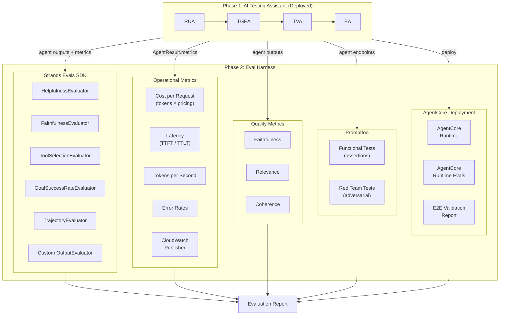

# Design Document: Testing Eval Harness (Phase 2)

## Overview

The Testing Eval Harness is a separate project that evaluates the Phase 1 AI Software Testing Assistant agents. It operates as an external test and evaluation framework — it imports/calls the Phase 1 agents and measures their quality, operational performance, security posture, and deployment readiness.

The harness uses five evaluation approaches, each based on specific reference implementations:

1. **Operational Metrics** — Cost, latency, TTFT/TTLT, throughput via CloudWatch
   - Reference: [01-operational-metrics](https://github.com/aws-samples/sample-gen-ai-evaluations-workshop/blob/main/01-operational-metrics/README.md)
   - Metrics: Cost per request, end-to-end latency, TTFT vs TTLT, tokens/sec, error rates, CloudWatch dashboards

2. **Quality Metrics** — Programmatic testing + LLM-as-judge for faithfulness, relevance, coherence
   - Reference: [02-quality-metrics](https://github.com/aws-samples/sample-gen-ai-evaluations-workshop/tree/main/02-quality-metrics)
   - Approaches: Ground truth validation, structured response parsing, automated accuracy scoring, multi-dimensional LLM-as-judge scoring

3. **Promptfoo** — Functional assertions and red-team adversarial testing
   - Reference: [05-01-Prompt-Foo](https://github.com/aws-samples/sample-gen-ai-evaluations-workshop/blob/main/05-framework-specific-evaluations/05-01-Prompt-Foo/README.md)
   - Capabilities: Code-based grading, automated metrics (BLEU, ROUGE, F1), red-team plugins (prompt injection, jailbreak, policy violation)

4. **Strands Evals SDK** — LLM-as-judge evaluators for agent output quality and trajectory
   - Reference: [Strands Evaluators](https://strandsagents.com/docs/user-guide/evals-sdk/evaluators/), [05-03-Strands](https://github.com/aws-samples/sample-gen-ai-evaluations-workshop/tree/main/05-framework-specific-evaluations/05-03-Strands)
   - Evaluators: OutputEvaluator, TrajectoryEvaluator, HelpfulnessEvaluator, FaithfulnessEvaluator, ToolSelectionEvaluator, GoalSuccessRateEvaluator

5. **AgentCore Runtime Evals** — Deploy to AgentCore and evaluate with built-in evaluators
   - Reference: [05-04-AgentCore-Runtime-Evals](https://github.com/aws-samples/sample-gen-ai-evaluations-workshop/blob/main/05-framework-specific-evaluations/05-04-AgentCore-Runtime-Evals/README.md)
   - Capabilities: Managed deployment, Builtin.Helpfulness evaluator, Builtin.ToolSelectionAccuracy evaluator, CloudWatch trace-based evaluation

## Architecture



## Components and Interfaces

### Module Structure

```
testing_eval_harness/
├── __init__.py
├── config.py                  # Eval harness configuration
├── strands_evals/
│   ├── __init__.py
│   ├── evaluator_config.py    # Evaluator setup per agent
│   ├── experiment_runner.py   # Experiment orchestration
│   └── rubrics.py             # Custom rubrics for OutputEvaluator
├── operational/
│   ├── __init__.py
│   ├── cost_tracker.py        # Token cost calculation
│   ├── latency_tracker.py     # TTFT/TTLT/throughput measurement
│   ├── error_tracker.py       # Error rate tracking
│   └── cloudwatch_publisher.py # CloudWatch metric publishing
├── quality/
│   ├── __init__.py
│   └── quality_scorer.py      # Faithfulness, relevance, coherence
├── promptfoo/
│   ├── __init__.py
│   ├── functional_config.py   # Promptfoo functional test configs
│   ├── redteam_config.py      # Promptfoo red-team configs
│   └── runner.py              # Promptfoo execution wrapper
├── deployment/
│   ├── __init__.py
│   ├── agentcore_deployer.py  # AgentCore deployment scripts
│   ├── agentcore_evals.py     # AgentCore runtime eval runner
│   └── e2e_validator.py       # Cross-platform E2E validation
├── reports/
│   ├── __init__.py
│   └── report_generator.py    # Unified evaluation report
└── run_eval.py                # CLI entry point
```

### Strands Evals SDK Integration

Each Phase 1 agent gets a tailored set of evaluators:

| Agent | Evaluators | Level |
|-------|-----------|-------|
| RUA | HelpfulnessEvaluator, FaithfulnessEvaluator | TRACE_LEVEL |
| TGEA | HelpfulnessEvaluator, ToolSelectionEvaluator, Custom OutputEvaluator | TRACE_LEVEL |
| TVA | FaithfulnessEvaluator, Custom OutputEvaluator | TRACE_LEVEL |
| Full Pipeline | GoalSuccessRateEvaluator, TrajectoryEvaluator | SESSION_LEVEL |

```python
from strands_evals import Case, Experiment
from strands_evals.evaluators import (
    HelpfulnessEvaluator, FaithfulnessEvaluator,
    ToolSelectionEvaluator, GoalSuccessRateEvaluator,
    TrajectoryEvaluator, OutputEvaluator
)

# Per-agent evaluators
rua_evaluators = [HelpfulnessEvaluator(), FaithfulnessEvaluator()]
tgea_evaluators = [HelpfulnessEvaluator(), ToolSelectionEvaluator(), OutputEvaluator(rubric=TGEA_RUBRIC)]
tva_evaluators = [FaithfulnessEvaluator(), OutputEvaluator(rubric=TVA_RUBRIC)]

# Session-level evaluators
pipeline_evaluators = [GoalSuccessRateEvaluator(), TrajectoryEvaluator(rubric=PIPELINE_RUBRIC)]
```

### Operational Metrics

```python
from dataclasses import dataclass

@dataclass
class OperationalMetrics:
    agent_name: str
    cost_usd: float              # tokens × per-token price
    latency_ms: float            # end-to-end
    ttft_ms: float               # time to first token
    ttlt_ms: float               # time to last token
    tokens_per_second: float     # output_tokens / (ttlt - ttft)
    input_tokens: int
    output_tokens: int
    error_count: int = 0
    throttle_count: int = 0

def calculate_cost(input_tokens: int, output_tokens: int, model_id: str) -> float:
    """Calculate cost based on token counts and model pricing."""
    pricing = {
        "us.anthropic.claude-sonnet-4-20250514-v1:0": {"input": 0.003, "output": 0.015},
        "groq/llama-3.3-70b-versatile": {"input": 0.00059, "output": 0.00079},
    }
    rates = pricing.get(model_id, {"input": 0.003, "output": 0.015})
    return (input_tokens * rates["input"] + output_tokens * rates["output"]) / 1000

def calculate_throughput(output_tokens: int, duration_seconds: float) -> float:
    """Calculate tokens per second."""
    return output_tokens / duration_seconds if duration_seconds > 0 else 0.0

def calculate_error_rate(error_count: int, total_invocations: int) -> float:
    """Calculate error rate."""
    return error_count / total_invocations if total_invocations > 0 else 0.0
```

### Promptfoo Integration

Promptfoo configs are YAML files that define functional and red-team tests:

```yaml
# promptfoo_functional.yaml
providers:
  - id: python:phase1_provider.py
    label: "AI Testing Assistant"

tests:
  - description: "RUA parses simple requirement"
    vars:
      input: "The system shall allow users to log in with email and password"
    assert:
      - type: is-json
      - type: javascript
        value: "output.requirements.length >= 1"

  - description: "TGEA generates test cases for each requirement"
    vars:
      input: '{"requirements": [{"id": "REQ-001", "description": "Login"}]}'
    assert:
      - type: is-json
      - type: javascript
        value: "output.test_cases.length >= 1"
```

```yaml
# promptfoo_redteam.yaml
redteam:
  purpose: "AI Software Testing Assistant that generates test cases"
  plugins:
    - prompt-injection
    - jailbreak
    - policy-violation
    - harmful-content
  strategies:
    - basic
    - crescendo
```

### AgentCore Deployment

```python
# Deployment verification
def verify_agentcore_deployment(agent_endpoints: dict) -> dict:
    """Verify each agent is accessible on AgentCore."""
    results = {}
    for agent_name, endpoint in agent_endpoints.items():
        # Health check call
        results[agent_name] = {"status": "healthy", "endpoint": endpoint}
    return results

# E2E validation combines all eval sources
def run_e2e_validation(agent_endpoints: dict) -> dict:
    """Run strands evals + promptfoo + agentcore evals against deployed agents."""
    return {
        "strands_evals": run_strands_evals(agent_endpoints),
        "promptfoo": run_promptfoo(agent_endpoints),
        "agentcore_evals": run_agentcore_evals(agent_endpoints),
        "deployment_ready": True  # computed from above
    }
```

## Data Models

```python
@dataclass
class EvalResult:
    evaluator_name: str
    agent_name: str
    score: float               # 0.0 to 1.0
    reasoning: str = ""
    level: str = ""            # OUTPUT_LEVEL, TRACE_LEVEL, SESSION_LEVEL

@dataclass
class PromptfooResult:
    test_name: str
    passed: bool
    agent_name: str
    input_text: str = ""
    output_text: str = ""
    attack_type: str = ""      # for red-team results
    severity: str = ""         # for red-team results

@dataclass
class EvaluationReport:
    run_id: str
    timestamp: str
    strands_eval_results: List[EvalResult] = field(default_factory=list)
    operational_metrics: List[OperationalMetrics] = field(default_factory=list)
    quality_scores: dict = field(default_factory=dict)  # {agent: {metric: score}}
    promptfoo_results: List[PromptfooResult] = field(default_factory=list)
    deployment_results: dict = field(default_factory=dict)
    overall_readiness: bool = False
```


## Correctness Properties

*A property is a characteristic or behavior that should hold true across all valid executions of a system-essentially, a formal statement about what the system should do. Properties serve as the bridge between human-readable specifications and machine-verifiable correctness guarantees.*

### Property 1: Evaluator scores are in valid range

*For any* agent output evaluated by any Strands Evals SDK evaluator (HelpfulnessEvaluator, FaithfulnessEvaluator, OutputEvaluator, ToolSelectionEvaluator, GoalSuccessRateEvaluator, TrajectoryEvaluator), the returned score should be a float in the range [0.0, 1.0] and the result should include a non-empty reasoning string.

**Validates: Requirements 1.1, 1.2, 1.3, 1.5**

### Property 2: Cost calculation correctness

*For any* non-negative integer values of input_tokens and output_tokens and a known model pricing table, `calculate_cost(input_tokens, output_tokens, model_id)` should return a non-negative float equal to `(input_tokens * input_rate + output_tokens * output_rate) / 1000`.

**Validates: Requirements 2.1**

### Property 3: Throughput calculation correctness

*For any* positive output_tokens count and positive duration_seconds, `calculate_throughput(output_tokens, duration_seconds)` should return `output_tokens / duration_seconds`. For zero or negative duration, it should return 0.0.

**Validates: Requirements 2.3**

### Property 4: Error rate calculation correctness

*For any* non-negative error_count and positive total_invocations, `calculate_error_rate(error_count, total_invocations)` should return `error_count / total_invocations`. For zero total_invocations, it should return 0.0.

**Validates: Requirements 2.5**

### Property 5: Quality scores are in valid range

*For any* agent response evaluated for faithfulness, relevance, and coherence, each quality score should be a float in the range [0.0, 1.0].

**Validates: Requirements 3.1, 3.2, 3.3**

### Property 6: Red-team vulnerability report completeness

*For any* red-team test that identifies a vulnerability, the resulting PromptfooResult should contain non-empty values for attack_type, input_text, output_text, and severity.

**Validates: Requirements 4.3**

## Error Handling

- **Agent unavailability**: If a Phase 1 agent is unreachable during evaluation, the harness records the error and continues with remaining agents. The evaluation report marks the agent as "unavailable".
- **Evaluator failures**: If a Strands Evals evaluator fails (LLM error, timeout), the harness catches the exception, records a score of -1.0 with the error message as reasoning, and continues.
- **CloudWatch publish failures**: If CloudWatch metric publishing fails, the harness logs the error and continues. Metrics are still available in the local report.
- **Promptfoo execution failures**: If promptfoo fails to run, the harness captures stderr and includes it in the report. Individual test failures are recorded normally.
- **AgentCore deployment failures**: If deployment to AgentCore fails, the harness records the deployment error and skips E2E validation for that agent.

## Testing Strategy

### Dual Testing Approach

- **Unit tests** verify deterministic calculations (cost, throughput, error rate) and report structure
- **Property-based tests** verify mathematical properties of metric calculations
- **Integration tests** verify end-to-end evaluation flows against Phase 1 agents

### Property-Based Testing

- **Library**: Hypothesis for Python
- **Minimum iterations**: 100 examples per property via `@settings(max_examples=100)`
- **Annotation format**: `# Feature: testing-eval-harness, Property {number}: {property_text}`

### Unit Testing

- **Framework**: pytest
- Covers metric calculation functions, report generation, config loading
- Covers promptfoo config generation and result parsing

### Test Organization

```
tests/
├── __init__.py
├── test_cost_tracker.py        # Property + unit tests for cost calculations
├── test_latency_tracker.py     # Unit tests for TTFT/TTLT measurement
├── test_error_tracker.py       # Property + unit tests for error rate
├── test_quality_scorer.py      # Unit tests for quality metric scoring
├── test_report_generator.py    # Unit tests for report structure
├── test_evaluator_config.py    # Unit tests for evaluator setup
└── test_promptfoo_runner.py    # Unit tests for promptfoo integration
```
