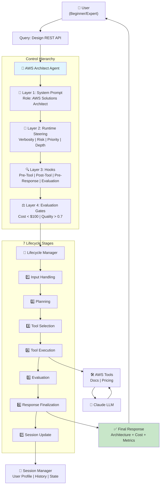
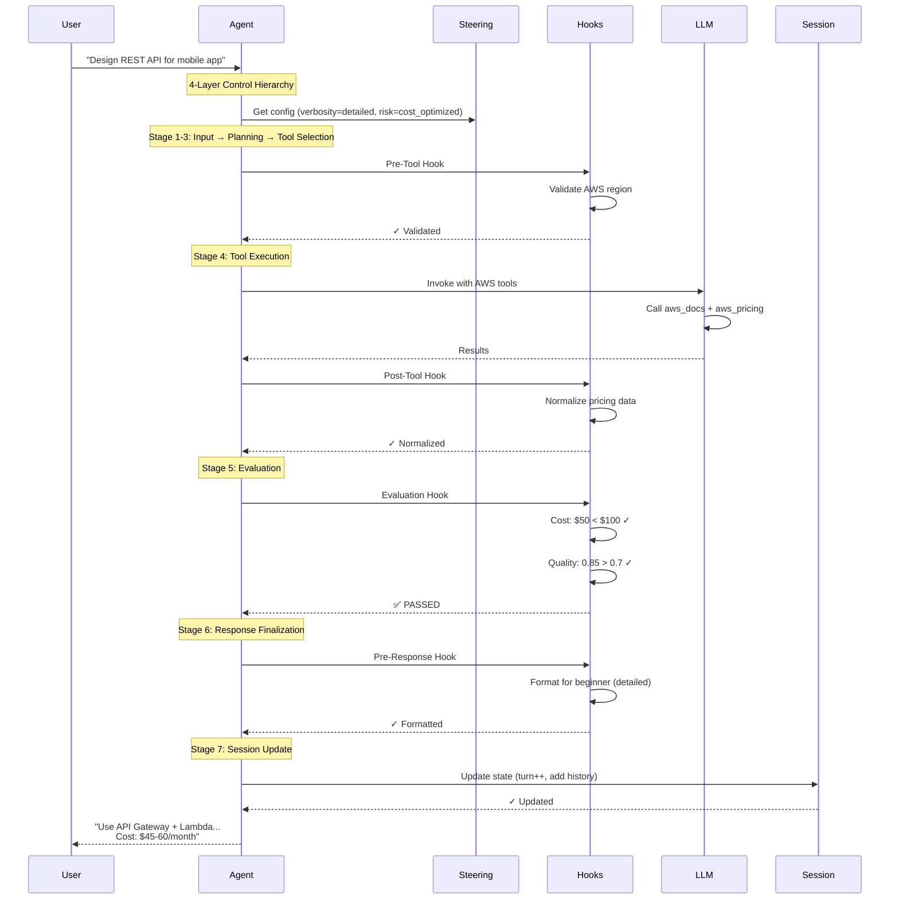

# Use Case Architecture Diagram

**Use Case**: AWS Solutions Architect Agent helping users design cloud architectures with complete control framework.

---

## 🏗️ Complete Architecture



---

## 🔄 Execution Sequence



---

## 📝 Example Scenarios

### Scenario 1: Beginner User (Cost-Sensitive)
```
Input: "Design REST API for mobile app"
Steering: verbosity=detailed, risk=cost_optimized
Output: Step-by-step explanation with cost breakdown
Result: API Gateway + Lambda, $45-60/month
```

### Scenario 2: Expert User (Performance-Focused)
```
Input: "Design serverless data pipeline with DynamoDB Streams"
Steering: verbosity=concise, risk=performance
Output: Technical architecture with service configs
Result: DynamoDB Streams → Lambda → EventBridge → Step Functions
```

---

## 🔗 Related Documentation

- **Architecture Details**: [README.md](README.md)
- **Implementation Guide**: [IMPLEMENTATION_GUIDE.md](IMPLEMENTATION_GUIDE.md)
- **Quick Start**: [QUICKSTART.md](QUICKSTART.md)

---

**Note**: These diagrams use Mermaid syntax and will render automatically on GitHub, GitLab, and many markdown viewers.
